## This document is proposal of [*Project1*](http://git.prototyping.id/20170595/Angry-Birds) by 20170595 _Yumin Jung_ 🚀

## Contents
- [Concept of the Game 🔥](#concept-of-the-game-)
  - [Angry Birds](#angry-birds)
- [Description of the Game 🎮](#description-of-the-game-)
  - [Characters and Ability](#characters-and-ability)
    - [Birds](#birds)
    - [Pigs](#pigs)
  - [Game Mechanics and Interfaces](#game-mechanics-and-interfaces)
- [Organization of code 📚](#organization-of-code-)
  - [UML](#uml)
  - [Main Functions and Classes](#main-functions-and-classes)
    - [Functions](#functions)
    - [Classes](#classes)
  - [Design Pattern](#design-pattern)
    - [Atomic Design Pattern](#atomic-design-pattern)
    - [Observer Design Pattern](#observer-design-pattern)
    - [Factory Design Pattern](#factory-design-pattern)
  - [Class and Module](#class-and-module)
- [Main Challenge ⭐️](#main-challenge-️)
  - [Appearance part](#appearance-part)
  - [Functional part](#functional-part)
- [Issue and Known Bug 🐞](#issue-and-known-bug-)
- [Reference 🌿](#reference-)

# Concept of the Game 🔥

## Angry Birds

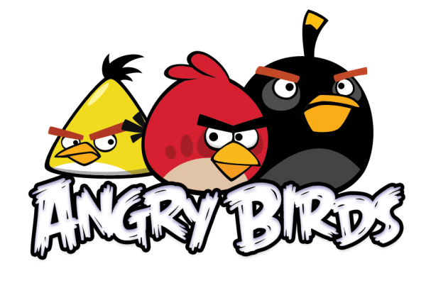

`Angry Birds` is a action-based video game created by [Rovio Entertainment](https://www.rovio.com/).

The game series focuses on a flock of birds who try to save their eggs from green pigs.

# Description of the Game 🎮

## Characters and Ability

### Birds
|                    Red                     |              Chuck               |              Bomb               |              Hal               |
| :----------------------------------------: | :------------------------------: | :-----------------------------: | :----------------------------: |
|  | 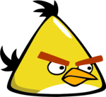 | 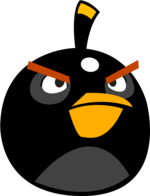 | 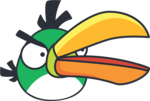 |
|                    Cute                    |             Speed Up             |           Bigger Size           |           Boomerang            |

### Pigs

|                      Minion                      |                      Corporal                      |                King                |
| :----------------------------------------------: | :------------------------------------------------: | :--------------------------------: |
|  |  | 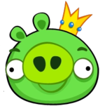 |
|                The Smallest Size                 |                    Medium Size                     |          The Biggest Size          |

## Game Mechanics and Interfaces

- ### Home Screen
  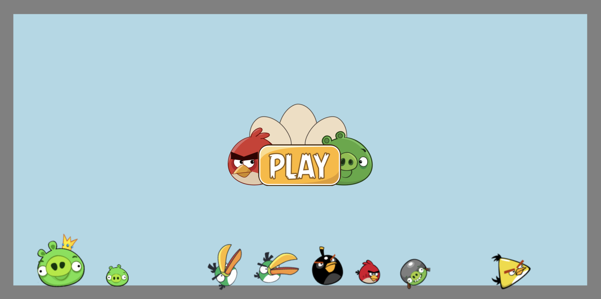

  - When user clicks screen, character of Angry Bird randomly falls from the sky.
  - User can move the characters on the screen by dragging.
  - When click the **play button**, user go to `Stage Select Screen`

- ### Stage Select Screen
  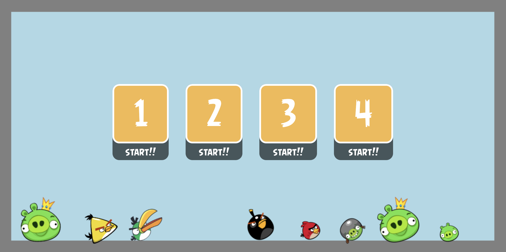

  - The characters created on the `Home Screen` remain in the background.
  - User can enjoy them with clicks and drags like `Home Screen`.
  - When click the stage button, user go to corresponding `Stage Screen`.

- ### Stage Screen
  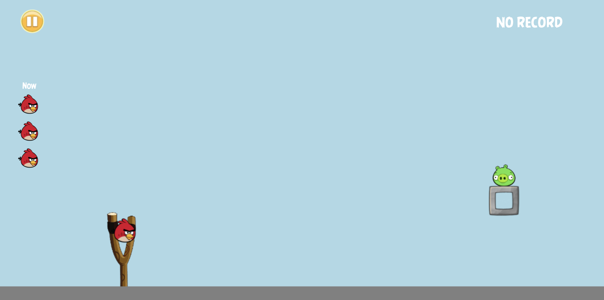
  
  - A slingshot and a bird are on the left side of the stage screen.
  - User can fire the bird by dragging slingshot back.
  - User must adjust the angle to get the pig out of the screen.
  - Remaining birds are displayed on the left side and are reduced one by one when the birds are fired.
  - To use each bird's ability, user have to press the space bar.
  
  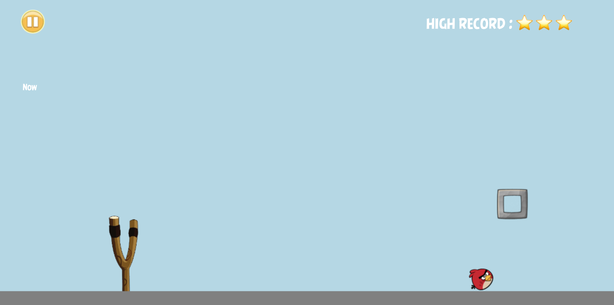

  - If the pig goes out of the screen, user get score.
  - When user press the pause button, user go to corresponding `Pause Screen`.
  
  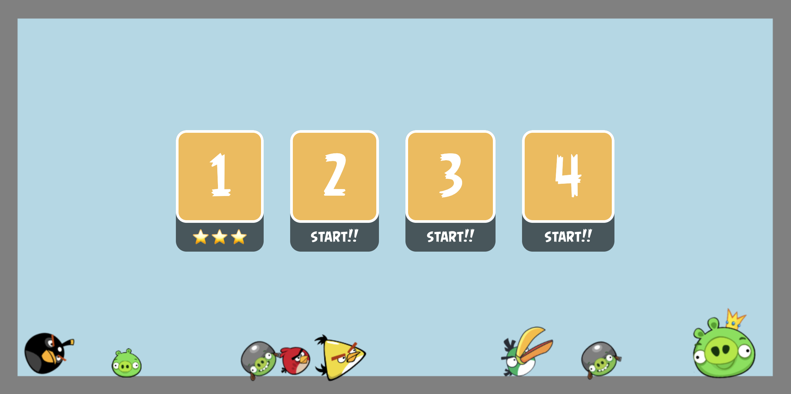

  - When the user records the highest score, the highest score appears on the stage `Select Screen`.

- ### Pause Screen
  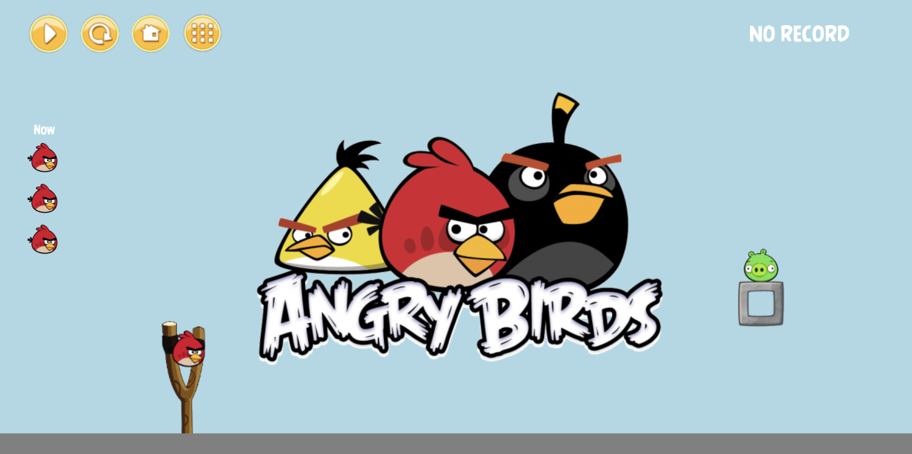

  - There are four buttons.
    - Play button
    - Restart button
    - Home button
    - Stage select button
  - Users cannot click on the game screen and must select one of the four buttons.
  - When user press the button, go to the corresponding screen.

# Organization of code 📚

## UML

This is UML of my implementation.

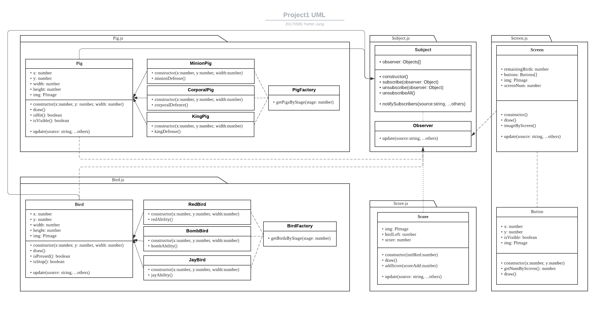

## Main Functions and Classes

### Functions
- Functions in main.js
  - `getStage()`
    - Add composites of stage and firing events
  - `resetStage()`
    - Reset stage and change state of stageName
  - `firingEvents()`
    - Check firing events
  - `setup()` and `draw()`
    - Using loop() and noLoop() function from p5.js library
    - Used to make the user feel like the screen is switching.

- Functions in stage classes
  - `getComposites()`
    - Return composites of stage
  - `updateScore()`
    - Transmit remaining birds and scores to the ScoreDisplay class.
  - `firing()`
    - When the bird is fired, place the new bird on the slingshot.
  
- Functions in bird classes
  - `ability()`
    - Activate the ability of a bird

### Classes
- Molecules classes (Bird, Box, Elastic, Ground, Pig)
  - **Base class** of specific character

- Stage Classes (TutorialStage, PyramidStage, TwoPyramidStage, BoomerangStage)
  - Add the bodies corresponding to each stage to the canvas
  - Manage the bird firing process
  - Manage scoring system with ScoreDisplay class

- ScoreDisplay
  - Receiving a score from the stage
  - Display high record on the game screen

## Design Pattern

### Atomic Design Pattern

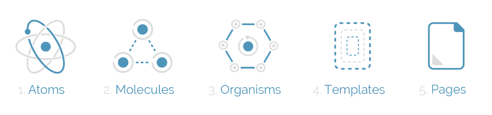

- Atomic design pattern helps to build consistent, solid and reusable design systems.
- Advantages when developed according to the atomic design pattern.
  - Increase the `productivity` of development.
  - Reduce `error` and error-prone code.

### Observer Design Pattern
- Scores were exchanged between score display and stage
- Make the code more simple.
- Different parts of code speak to each other.
  
### Factory Design Pattern
- Each stage was constructed using the factory design pattern.
- When the stage was restarted, implementation through the factory design pattern was able to make the code more concise.

## Class and Module
- All characters and structures of the game were implemented as classes.
- Make available to use each other by importing or exporting them through modules.
- Different parts of code speak to each other.

# Main Challenge ⭐️
The main challenge of the project is,

> Implementing slingshot same as the actual Angry Birds'


Therefore, I using some of the methods of [Matter.js](https://brm.io/matter-js/) library for implementation.

## Appearance part

Make slingshot look more like real Angry Birds'!
- Image of slingshot used in real Angry bird should be used in the render canvas of this game.
  - --> But, bodies are affected by each other in Matter.js render canvas.
  - --> Therefore, solved by making the actual body size smaller and only the size of the render image larger.
- Make left and right elastic band of slinghot by Constraint method of Matter.js
  - In addition, adjust color and thickness of the elastic band look more like real Angry Birds'.
  
    ```js
    // Elastic class
    class Elastic extends Body {
      constructor(x, y, bird) {
          super();
          this.bird = bird;
          const options = {
              pointA: {
                  x: x,
                  y: y
              },
              bodyB: this.bird,
              stiffness: 0.05,
              render: {
                  type: "line",
                  strokeStyle: '#120E0A',
                  lineWidth: 8
              }
          }
          this.body = Matter.Constraint.create(options);
      }
    }
    ```

## Functional part

Make slingshot function more like real Angry Birds'!
- Function of a bird to fire from a slingshot
  - Firing birds with using position of the bird that the user dragging

    ```js
    // Events detector in firingEvents function
    Events.on(mouseConstraint, 'enddrag', function (event) {
        stage.flyingBird = stage.bird;
        stage.slingshot.elastic1.body.render.visible = false;
        stage.slingshot.elastic2.body.render.visible = false;
        if (event.body == stage.bird.body) {
            firing = true;
            stage.remaingBirds -= 1;
        }
    })

    Events.on(engine, 'afterUpdate', function () {
        addScore(stage)
        if (firing && Math.abs(stage.bird.body.position.x - BIRD_X) < 20
            && Math.abs(stage.bird.body.position.y - BIRD_Y) < 20
            && stage.remainingBirds > 0) {
            stage.firing(engine.world);
            firing = false;
        }
    })
    ```
  - Check the bird has been fired and connect the new bird to the slingshot.

    ```js
    // firing function in TutorialStage class
    firing(world) {
        ...
        this.remainingBirds -= 1;
        if (this.remainingBirds == 0) {
            slingshot.elastic1.body.bodyB = null;
            slingshot.elastic2.body.bodyB = null;
            Composite.remove(world, slingshot.getLeftElastic());
            Composite.remove(world, slingshot.getRightElastic());
        } else {
            let newBird = new RedBird(BIRD_X, BIRD_Y, 20);
            this.bird = newBird;
            bird = this.bird;
            Composite.add(world, bird.getBody());
            slingshot.elastic1.body.bodyB = bird.getBody();
            slingshot.elastic2.body.bodyB = bird.getBody();
        }
    }
    ```
# Issue and Known Bug 🐞
- When user drags a bird from a slingshot, it does not support mouse event outside of the render canvas.

# Reference 🌿
- ### Load Matter.js into P5.js
  - [flanniganable YouTube](https://www.youtube.com/watch?v=wcpmI8H_i8Mlist=PLuywqn95st9THjyjehRn3epVUdjbcYIAT&ab_channel=flanniganable)
- ### Implement Code with Matter.js
  - [Matter.js Documentation](https://brm.io/matter-js/docs/)
  - [Matter.js GitHub](https://github.com/liabru/matter-js)
  - [The Coding Train YouTube](https://www.youtube.com/channel/UCvjgXvBlbQiydffZU7m1_aw)
  - [P5.js + Matter.js Examples](https://github.com/b-g/p5-matter-examples)
- ### Helped to Implement Angry Birds
  - [Angry Birds with Matter.js](https://www.youtube.com/watch?v=TDQzoe9nslY&ab_channel=TheCodingTrain)
  - [Angry Birds Wiki](https://angrybirds.fandom.com/wiki/Angry_Birds_Wiki)
- ### Design Pattern
  - [Atomic Design Pattern](https://danilowoz.com/blog/atomic-design-with-react)