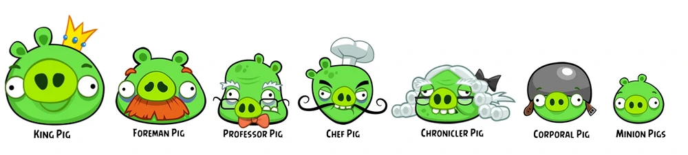
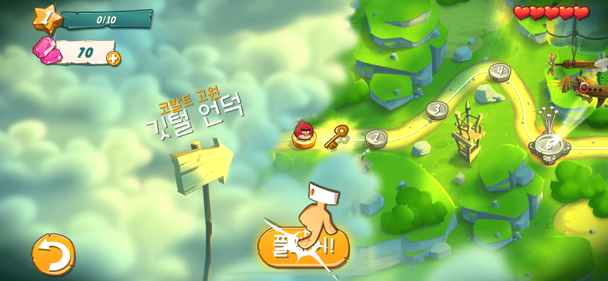
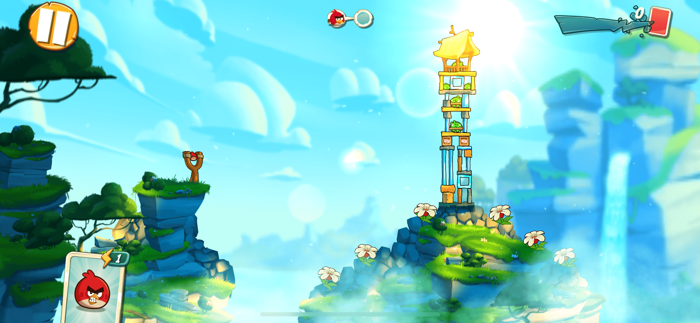
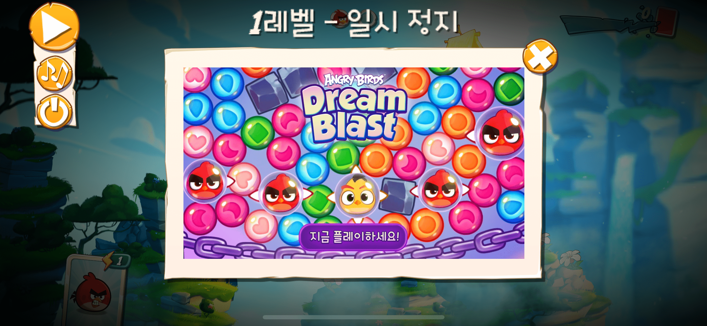

## This document is proposal of [*Project1*](http://git.prototyping.id/20170595/homework6.git) by 20170595 _Yumin Jung_

## Contents
- [Angry Birds](#angry-birds)
  - [Game Mechanics](#game-mechanics)
- [How will the game look like?](#how-will-the-game-look-like)
  - [Game Elements](#game-elements)
    - [Characters](#characters)
    - [Interface](#interface)
- [How will they be implemented in code?](#how-will-they-be-implemented-in-code)
- [Main Challenge](#main-challenge)

# Angry Birds


**Angry Birds** is a Finnish action-based video game created by [Rovio Entertainment](https://www.rovio.com/). The game series focuses on a flock of birds referred to by the same name who try to save their eggs from green pigs.

## Game Mechanics
- On the **home screen**, the user selects the stage to challenge and presses the play button.
- If you press the pause button on the **play screen**, it returns **pause screen**, and if you press Exit, it returns to the **home screen**.
- When the bird is in the slingshot, the user presses the bird with his finger and pulls it back to aim the green pigs.
- Points are scored based on how many green pigs were thrown out by birds.

# How will the game look like?
## Game Elements

### Characters
There are many different kinds of birds and pigs in **Angry Birds**.




### Interface
There are GUI such as **play button** and **pause button** on the screen of the game.

1. Home screen
  


2. Play screen



3. Pause screen



# How will they be implemented in code?
As shown in the [above figure](#characters), birds are different in size and ability and pigs are different in size and defense. But they also have something in common. For example, birds can score points by matching pigs.

Therefore, I will implement through,
1. Inheritance of birds and green pig objects
2. Factory design pattern to creates bird and green pig objects
3. Observer design pattern
   - to get points when the bird hits the pig
   - to return screen according to the input of the button

**Above features were learned in class and homework5.**

This is UML of my implementation.


The following is part of the code to be implemented.
```js
// Notify event to subscribers
this.notifySubscribers('birds', x, y);

// Subject.js
class Subject {
    constructor() {
        this.observers = [];
    }
    subscribe(observer) {
        if (observer != null) this.observers.push(observer);
    }
    ...
}

export { Subject };

```

# Main Challenge
The main challenge of the project is,

> Implementing laws of physics such as gravity in the game.

Therefore, I will use the [Matter.js](https://brm.io/matter-js/) library to implement the laws of physics. 


Matter.js is a 2D physics engine for the web and you can see demos [here](https://brm.io/matter-js/demo/#mixed).

I will use Matter.js to implement the trajectory of a bird flying from a slingshot and the situation of a bird hitting a structure such as a pig or a tree.